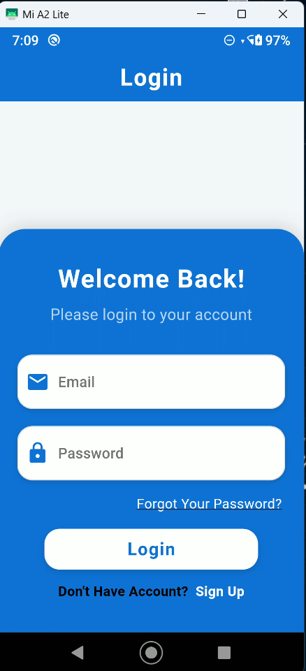
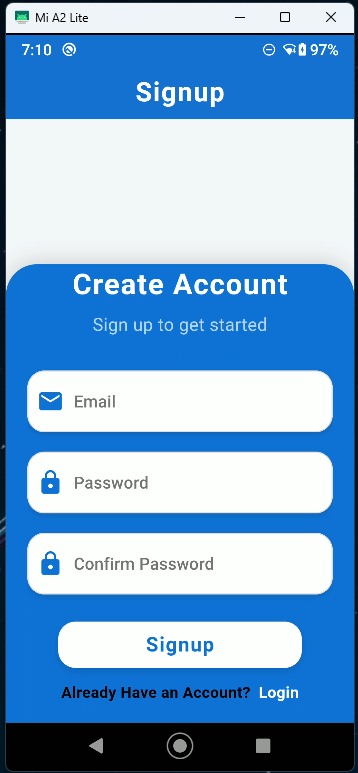
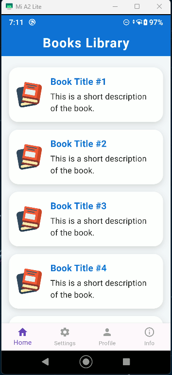
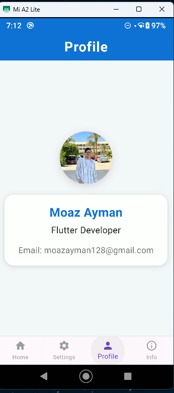
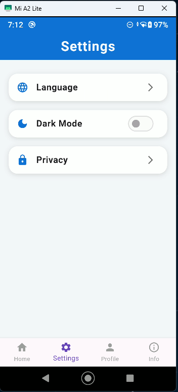

#  ITI Task  

A modern Flutter authentication app with a unified, clean UI for Login, Signup, OTP, Home, Profile, Settings, and Info screens.

---

##  UI Screens

### 🔸 Login




---

### 🔸 Signup



---

### 🔸 OTP


---

### 🔸 Home



---

### 🔸 Profile



---

### 🔸 Settings



---

### 🔸 Info


---


## 📂 Folder Structure

```plaintext
lib/
│   main.dart                # Entry point
│
├── constants/               # App colors & strings
│   ├── app_colors.dart
│   └── app_strings.dart
│
├── pages/                   # All app screens
│   ├── login_screen.dart
│   ├── signup_screen.dart
│   ├── otp_screen.dart
│   ├── home_screen.dart
│   ├── home_body.dart
│   ├── profile_screen.dart
│   ├── settings_screen.dart
│   ├── info_screen.dart
│   └── main_page.dart
│
├── widgets/                 # Custom reusable widgets
│   ├── custom_button.dart
│   ├── custom_text_form_field.dart
│   ├── custom_text_row.dart
│   └── blue_container.dart

assets/                      # Images & assets (screenshots here)
├── login.png
├── signup.png
├── otp.png
├── home.png
├── profile.png
├── settings.png
├── info.png
└── aa.jpg
```

## 🛠️ Features

- Modern, unified UI for all screens
- Consistent color theme
- Custom reusable widgets
- Smooth user experience


## 🚀 Getting Started

flutter pub get
flutter run
Make sure you have Flutter SDK installed and connected to a device/emulator.

##  Tech Stack
Flutter

Dart

Custom Widgets

Clean UI principles
