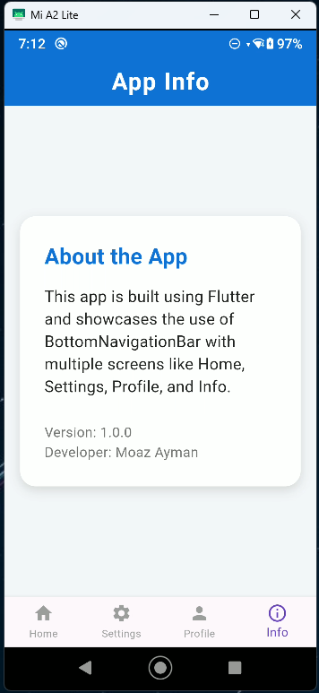

# Auth Task 2

<<<<<<< HEAD
## Ui Screens

## Login UI


## Signup UI


## OTP UI


=======
A modern Flutter authentication app with a unified, clean UI for Login, Signup, OTP, Home, Profile, Settings, and Info screens.

---

## 📱 Screenshots

| Login                 | Signup                 | OTP                 | Home                 | Profile                 | Settings                | Info                 |
| --------------------- | ---------------------- | ------------------- | -------------------- | ----------------------- | ----------------------- | -------------------- |
|  |  |  |  |  |  |  |

---

## 📂 Folder Structure

```
lib/
  main.dart                // Entry point
  constants/               // App colors & strings
    app_colors.dart
    app_strings.dart
  pages/                   // All app screens
    login_screen.dart
    signup_screen.dart
    otp_screen.dart
    home_body.dart
    home_screen.dart
    profile_screen.dart
    settings_screen.dart
    info_screen.dart
    main_page.dart
  widgets/                 // Custom reusable widgets
    custom_button.dart
    custom_text_form_field.dart
    custom_text_row.dart
    blue_container.dart
assets/                    // Images & assets (screenshots here)
  login.png
  signup.png
  otp.png
  home.png
  profile.png
  settings.png
  info.png
  aa.jpg
```

---

## 🚀 Getting Started

1. **Install dependencies:**
   ```bash
   flutter pub get
   ```
2. **Run the app:**
   ```bash
   flutter run
   ```

---

## 🛠️ Features

- Modern, unified UI for all screens
- Consistent color theme
- Custom reusable widgets
- Smooth user experience
>>>>>>> 4e01ade (Update project structure and documentation; add assets and enhance README with screenshots and features)
