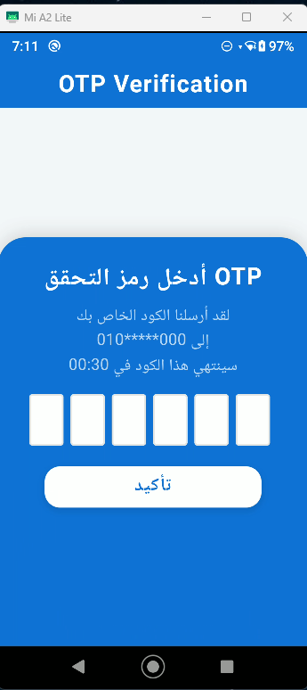

# Auth Task 2

A modern Flutter authentication app with a unified, clean UI for Login, Signup, OTP, Home, Profile, Settings, and Info screens.

##  UI Screens

### 🔸 Login

---

### 🔸 Signup

---

### 🔸 OTP

---

### 🔸 Home

---

### 🔸 Profile

---

### 🔸 Settings

---

### 🔸 Info

## 📂 Folder Structure

lib/
  main.dart                // Entry point
  constants/               // App colors & strings
    app_colors.dart
    app_strings.dart
  pages/                   // All app screens
    login_screen.dart
    signup_screen.dart
    otp_screen.dart
    home_body.dart
    home_screen.dart
    profile_screen.dart
    settings_screen.dart
    info_screen.dart
    main_page.dart
  widgets/                 // Custom reusable widgets
    custom_button.dart
    custom_text_form_field.dart
    custom_text_row.dart
    blue_container.dart
assets/                    // Images & assets (screenshots here)
  login.png
  signup.png
  otp.png
  home.png
  profile.png
  settings.png
  info.png
  aa.jpg

## 🛠️ Features

- Modern, unified UI for all screens
- Consistent color theme
- Custom reusable widgets
- Smooth user experience
>>>>>>> 4e01ade (Update project structure and documentation; add assets and enhance README with screenshots and features)
